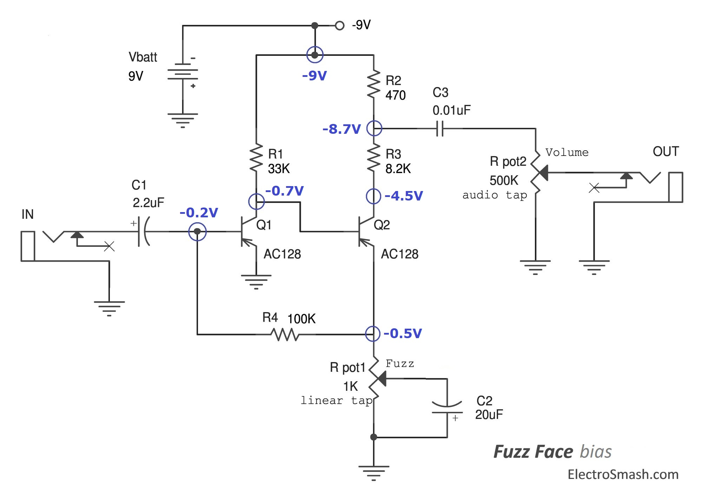

# A Fuzz Face emulation
This is just a really basic simulation of a Fuzz Face, one of the most famous
and recognizable distortion effects ever made—given that it's so simple to draw,
I figured I'd give it a whirl in Julia using [`ACME.jl`][acme].

[][electrosmash]

The audio sample in this repo is taken from [Sub-d][subd] on
[freesound][freesound], and is under a CC0 license.

[acme]: https://github.com/HSU-ANT/ACME.jl

[electrosmash]: https://www.electrosmash.com/fuzz-face

[subd]: https://freesound.org/people/Sub-d/sounds/49658/

[freesound]: https://freesound.org
