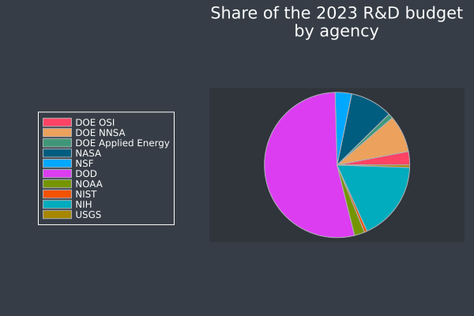

# 2023 US Federal Science Budget
I just wanted to crunch some numbers, so I took the [AIP budget
report](https://www.aip.org/fyi/federal-science-budget-tracker/FY2023) and
crunched the numbers. The military proper takes up 53.44% of the US's science
budget, but if you count the NNSA in there, it's more like 61.69%. Of course,
this is all for agencies relevant to *physicists*, but most of the agencies
here are also important for chemists, biologists, doctors, and more. Of course,
the USDA and EPA weren't included here, so they've been left out, as I was too
lazy to actually check them.

Budgeting is important, and it shows where the US's priorities lie—judging by
the breakdown, it's pretty obvious what the federal government likes to fund.

In the future I plan on making a webscraping script to automatically get the
budget results for any given year on the AIP's record.

## Budget breakdown

| Agency   | Budget (in millions of dollars) | Share of the total budget |
|:---------|:--------------------------------|:--------------------------|
| DOE-OSI  |   8,100                         |  3.01%                    |
| DOE-NNSA |  22,163                         |  8.23%                    |
| DOE-AE   |   2,891                         |  1.07%                    |
| NASA     |  25,384                         |  9.44%                    |
| NSF      |   9,874                         |  3.67%                    |
| DOD      | 143,777                         | 53.45%                    |
| NOAA     |   6,201                         |  2.30%                    |
| NIST     |   1,654                         |  0.61%                    |
| NIH      |  47,459                         | 17.64%                    |
| USGS     |   1,497                         |  0.56%                    |

## Brief rundown of major US science agencies
+ **[Department of Energy, Office of Science (DOE-OSI)][doeOSI] –** The US's 
  major non-military, (mostly) non-medical science program; funds R&D in areas 
  relevant to the DOE, and runs 10 of the DOE's 18 national labs.
+ **[DOE National Nuclear Security Agency (DOE-NNSA)][doeNNSA] –** A major part 
  of the US's nuclear weapons program; funds R&D in areas relevant to the DOE's
  nuclear weapon program and nuclear non-proliferation, and runs 3 of the DOE's
  18 national labs.
+ **[DOE Applied Energy (DOE-AE)][doeAE] –** Funds applied R&D in renewable and
  non-renewable energy sources, and runs ARPA-E (an attempt to model DARPA's
  success for renewable energy).
+ **[National Aeronautics and Space Administration (NASA)][nasa] –** The US's
  space program; does space stuff, and funds people to help them do space
  stuff. Everybody knows what NASA does.
+ **[National Science Foundation (NSF)][nsf] –** The US's second major non-
  military, general R&D program; funds people in virtually all areas of science;
  far more general than the DOE-OSI.
+ **[Department of Defense (DOD)][dod] –** The US's military; spends most of
  its money on weapons programs, runs *many* research laboratories, charters
  [FFRDCs][ffrdc], gives money to contractors, and funds most R&D in the 
  country.
+ **[National Ocean and Atmospheric Administration (NOAA)][noaa] –** Run by the 
  Department of Commerce; America's main marine and atmospheric science 
  administration; funds a few laboratories and gives out grants for relevant 
  areas.
+ **[National Institute of Standards and Technology (NIST)][nist] –** Run by 
  the Department of Commerce; a series of research labs dedicated to R&D, 
  primarily for metrology.
+ **[National Institute of Health (NIH)][nih] –** America's main medical 
  research agency; funds the Institute's various centers, as well as external 
  R&D.
+ **[United States Geological Survey (USGS)][usgs] –** America's primary 
  geology R&D program; funds internal and external research.

[doeOSI]: https://www.energy.gov/science/office-science

[doeNNSA]: https://www.energy.gov/nnsa/national-nuclear-security-administration

[doeAE]: https://www.energy.gov/eere/office-energy-efficiency-renewable-energy

[nasa]: https://www.nasa.gov

[nsf]: https://www.nsf.gov

[dod]: https://www.dod.gov

[noaa]: https://www.noaa.gov

[ffrdc]: https://www.nsf.gov/statistics/ffrdclist/

[nist]: https://www.nist.gov

[nih]: https://www.nih.gov

[usgs]: https://www.usgs.gov
