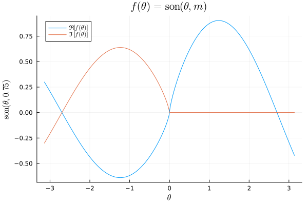

# Making a weird periodic function

It's widely known that the sine and cosine function are very similar, differing
only by a phase angle.
$$\sin \theta = \sum_k \frac{ (-1)^k \theta^{2k+1} }{\left(2k+1\right)!}\,,$$
and
$$\cos \theta = \sum_k \frac{ (-1)^k \theta^{2k} }{(2k)!} \,.$$
So, that leads me to wonder: is there a way to *interpolate* between the two
trigonometric functions?—and would it even be worth it in the first place?

Rather than trying to do some magic math—which I'm really *not* in the mood for
right now—instead notice that the only thing separating $\sin \theta$ and $\cos
\theta$ are the $2k + 1$ and $2k$ terms. Therefore, all you need to do to
interpolate is use some arbitrary variable $m$ that ranges between $0$ and $1$.
Therefore, we can define a new, weird function
$$\text{son}(\theta, m) = \sum_k \frac{ (-1)^k \theta^{2k + m} }{ \left(2k + 
m\right)!} \,.$$
This function is not named after anything particular, and is chosen arbitrarily 
because "sun" sounds like a weird hybrid between "sine" and "cosine".

